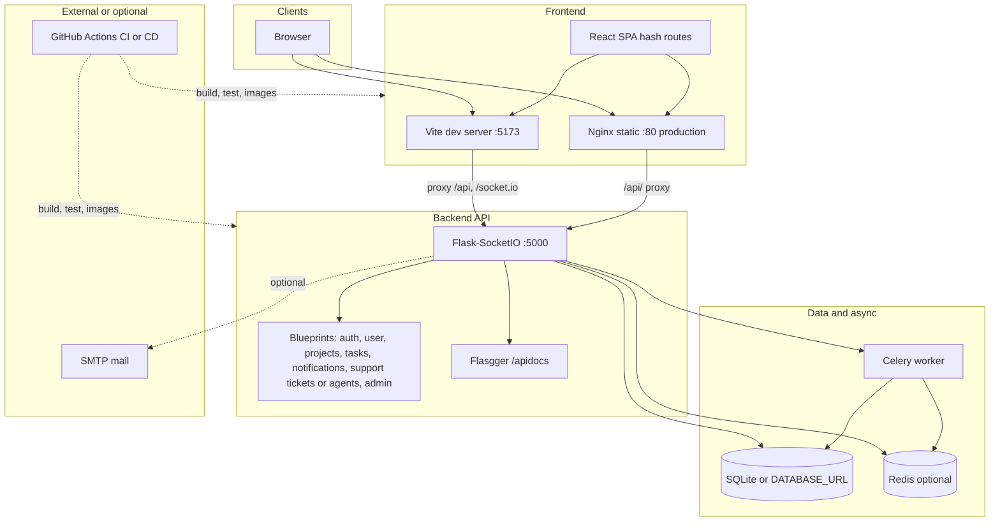
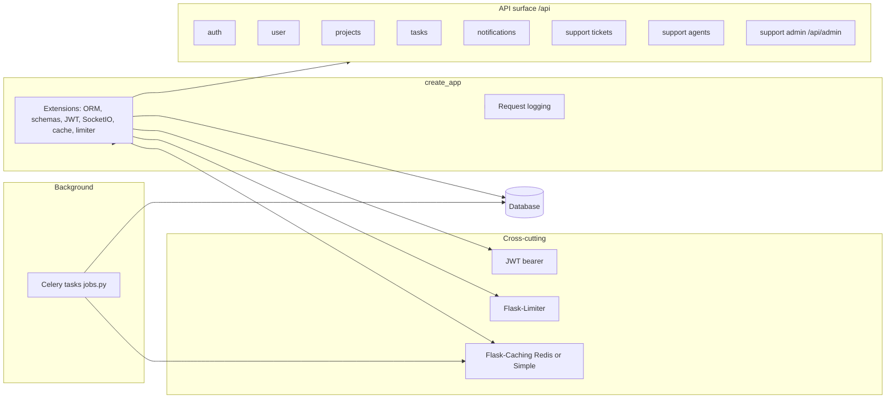
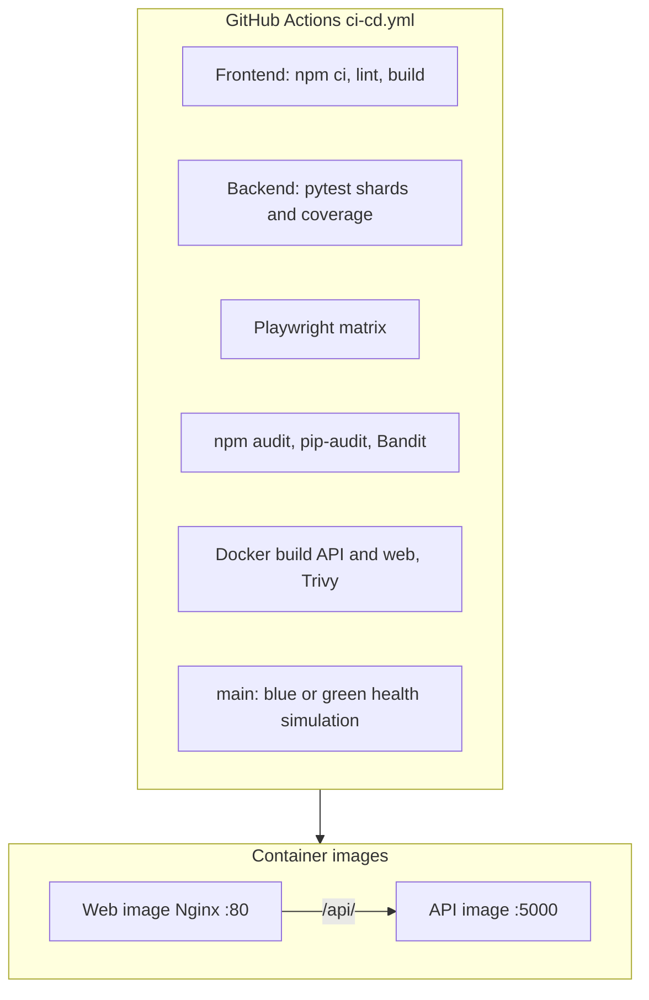

# Architecture

This document describes how the **Team & Support Portal** is structured: the React/Vite client, the Flask API, data stores, optional async workers, and how CI builds and validates container images.

For run instructions see **[RUNNING.md](../RUNNING.md)**. For integration audit notes see **[CODEBASE_AUDIT_INTEGRATION.md](CODEBASE_AUDIT_INTEGRATION.md)**.

---

## System context

High-level data flow: the browser loads the SPA from Vite (development) or Nginx (production image). REST calls go to `/api` (proxied in dev, reverse-proxied in the frontend Docker image). Real-time traffic uses Flask-SocketIO (`/socket.io` in development via the Vite proxy).

---

## Backend composition

The Flask app is created in `backend/app.py` (`create_app`). Extensions include SQLAlchemy, Marshmallow, JWT, SocketIO, caching, and rate limiting. Blueprints are registered under `/api` (and `/api/admin` for support admin routes).

**Celery tasks** (see `backend/jobs.py`): `tasks.warm_project_tasks_list_cache`, `tasks.recompute_project_metrics`.

---

## Frontend routes

Hash-based routing is implemented in `src/App.tsx`. `AuthProvider` wraps the application.

| Route | Page | Notes |
| --- | --- | --- |
| `#/login` | `LoginPage` | Bare layout (no navbar) |
| `#/register` | `RegistrationPage` | Bare layout |
| `#/support` | `SupportCenter` | Support role required for full features |
| `#/team` | `TeamDashboard` | Requires authentication |

In development, `vite.config.ts` proxies `/api` and `/socket.io` to `http://localhost:5000` (and WebSockets). In production, set `VITE_API_BASE_URL` at build time if the API is not same-origin, or configure the static host to proxy `/api` (see **[RUNNING.md](../RUNNING.md)**).

---

## Deployment and CI

Container images: `docker/backend.Dockerfile` (Python API on port 5000), `docker/frontend.Dockerfile` (multi-stage Node build + Nginx). The Nginx default config (`docker/nginx-default.conf`) serves the SPA and proxies `/api/` to the backend service.

Optional local **Redis** for Flask-Caching and Celery broker or result backend: `docker-compose.yml` (see **[RUNNING.md](../RUNNING.md)**).

---

## Configuration pointers

| Concern | Location |
| --- | --- |
| Database URI, JWT, mail, Redis, Celery | `backend/config.py` |
| Vite dev proxy | `vite.config.ts` |
| Production API proxy from Nginx | `docker/nginx-default.conf` |

Diagrams use [Mermaid](https://mermaid.js.org/); they render on GitHub and in many Markdown preview tools.
